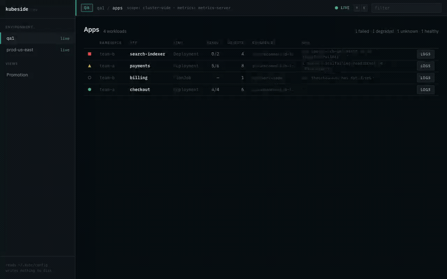
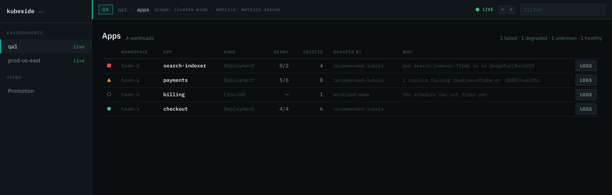
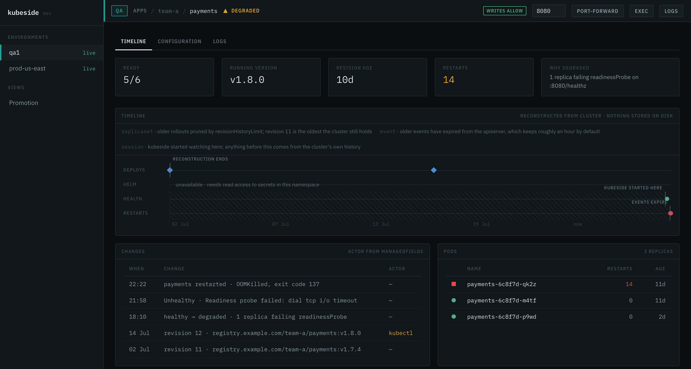
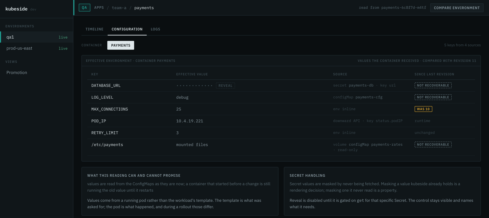
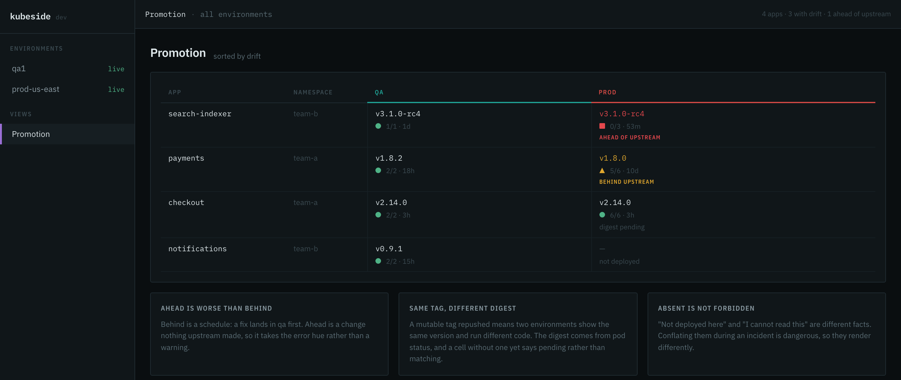

<div align="center">

# kubeside

**Your apps, across every cluster, without thinking in ReplicaSets.**

A Kubernetes client scoped to the developer who ships the app, not the operator
who runs the cluster. One binary, no database, no agent, no setup step.

[Documentation](https://kubeside.dynaum.com/) ·
[Install](https://kubeside.dynaum.com/docs/01-install.html) ·
[Why it exists](docs/01-problem.md)



</div>

## The problem

Every Kubernetes UI mirrors the API tree: pick a resource kind, browse
instances, pick a cluster from a switcher. That is the right shape for the
person who runs the cluster. It is the wrong shape for the person who ships an
app.

A developer thinks in services, not ReplicaSets. Their unit of work is one app
across qa, stg, and prod, and their questions are historical more often than
live: what changed, who changed it, what did the container actually get.
Answering any of those today means three terminals, a tab per replica, and a
guess.

So the dashboards end up as launchers for `kubectl`, and four questions stay
unanswered. Not because they are hard, but because nobody built the screen for
them.

kubeside answers exactly those four, and deliberately refuses to answer anything
else:

1. **Is my app up?**
2. **What changed, and when?**
3. **What do the logs say, across every pod at once?**
4. **What configuration did the container actually receive?**

Across qa, stg, and prod, side by side.

## Install

```
brew install dynaum/tap/kubeside
kubeside
```

macOS, Linux, and Windows binaries are on the
[releases page](https://github.com/dynaum/kubeside/releases). One file, no
runtime, no installer, no agent in your cluster. The UI is embedded in the
binary.

No setup step either. kubeside reads the kubeconfig already on your machine,
loads every context, and runs exec credential plugins natively. If `kubectl`
works, kubeside works.

Until the first release is tagged, build it:

```
npm --prefix web ci && npm --prefix web run build   # the UI is embedded, so it goes first
go build ./cmd/kubeside && ./kubeside
```

Full instructions: [the install guide](docs/guide/01-install.md).

## Is my app up



Every app you own, in every cluster your kubeconfig reaches, grouped as apps
rather than as ReplicaSets. Health is derived and the row says what derived it:
`pod search-indexer-75f4d is in ImagePullBackOff` beats a red dot. The
`GROUPED BY` column names the rule that produced each row, so a list that looks
wrong tells you why it looks wrong.

A cluster that cannot be reached says so in its own row. It never contributes
silence to somebody else's list.

## What changed, and when



The timeline is reconstructed on demand from history Kubernetes already keeps:
ReplicaSets, ControllerRevisions, Helm release secrets, pod termination states,
and events still inside the apiserver's TTL. Changes carry an actor read from
`managedFields`, so the `kubectl` nobody admits to shows up next to the rollout
it caused.

Where its knowledge ends, it draws the horizon:

```
replicaset · older rollouts pruned by revisionHistoryLimit; revision 11 is the oldest the cluster still holds
event      · older events have expired from the apiserver, which keeps roughly an hour by default
session    · kubeside started watching here; anything before this comes from the cluster's own history
```

A source your role cannot read becomes a labelled gap. An empty axis is never
rendered as a quiet period.

## What the container actually received



Environment resolved through `env`, `envFrom`, `configMapKeyRef`,
`secretKeyRef`, the downward API, and mounted volumes, each key attributed to
its source and compared against the previous revision.

Secret values are masked because kubeside never fetched them. Revealing one asks
your cluster whether you may `get` that specific Secret, and if the answer is
no, the control is disabled and names the verb rather than disappearing.

## Is the fix in prod yet



One row per app, one column per environment. A version prod has that staging
does not floats to the top, because a hotfix nobody back-merged is the worst
thing on this screen. Same tag with a different digest is called out. An
environment you cannot read says `not readable`, which is not the same as
`absent`.

## What it promises

**Nothing is written to disk.** No database, no cache file, no history
directory. Stop the server and nothing is left behind. This is the product's
central bet: everyone assumes history needs storage, so nobody assembles the
history Kubernetes already keeps.

**Absence of knowledge is not absence of a thing.** A metric it could not take
is reported as unavailable, never as zero. A kind it could not list is named. A
window it cannot see into is hatched, not blank.

**A control is never hidden for lack of permission.** It is disabled and names
the verb the cluster refused. The security boundary is your cluster's RBAC,
resolved with SelfSubjectAccessReview; the guardrails on top are ergonomics, and
both answers travel together.

**Credentials stay on your machine.** The kubeconfig is read-only input, never
edited and never copied. The browser talks to `127.0.0.1` and never to an
apiserver.

## What it will not do

No node view. No PersistentVolume browsing. No RBAC editor. No CRD browser. No
Helm chart management. No cost reporting. No topology graph. No YAML editor
beyond a read-only viewer. No plugin system.

Each is a legitimate need belonging to somebody else's tool. Shipping any of
them turns this into a general-purpose dashboard, which is the thing there is
already enough of.

## Status

Released. The app list, whole-workload logs, the reconstructed timeline,
resolved configuration, cross-environment diff, the promotion matrix, fleet,
port-forward, the command palette, prod guardrails, and exec are built, tested,
and driven against real clusters.

Before v1.0.0 a security review went over the write paths, the local server, and
the two claims this README makes loudest. Everything it found is fixed: the
port-forward path now asks the cluster and the guard before it dials, the
permission cache can no longer answer a question it was not asked, the session
token is handed over once instead of living in your browser history, and the
secret fingerprint is keyed so it cannot confirm a guessed value.

## Documentation

The full site is at
**[kubeside.dynaum.com](https://kubeside.dynaum.com/)**.

**Guide** — [install and run](docs/guide/01-install.md) ·
[first run](docs/guide/02-first-run.md) ·
[the app list](docs/guide/03-apps.md) ·
[logs](docs/guide/04-logs.md) ·
[the timeline](docs/guide/05-timeline.md) ·
[resolved configuration](docs/guide/06-configuration.md) ·
[promotion and drift](docs/guide/07-promotion.md) ·
[port-forward, exec, guardrails](docs/guide/08-actions.md) ·
[keyboard](docs/guide/09-keyboard.md) ·
[the config file](docs/guide/10-config-file.md) ·
[permissions](docs/guide/11-permissions.md) ·
[when things are missing](docs/guide/12-troubleshooting.md) ·
[fleet, one app across every cluster](docs/guide/13-fleet.md)

**Design notes** — [the problem](docs/01-problem.md) ·
[personas](docs/02-personas.md) ·
[product spec](docs/03-product-spec.md) ·
[multi-cluster](docs/04-multi-cluster.md) ·
[architecture](docs/05-architecture.md) ·
[roadmap](docs/06-roadmap.md)

## Contributing

The design documents are the specification, and they were reviewed before any
code existed. If a change contradicts one, the document gets updated in the same
commit rather than quietly diverging.

Tests come before implementation. `go test ./...`,
`npm --prefix web run test`, and the Playwright screenshot gate all run in CI,
on Linux, macOS, and Windows.

## License

Apache-2.0.
