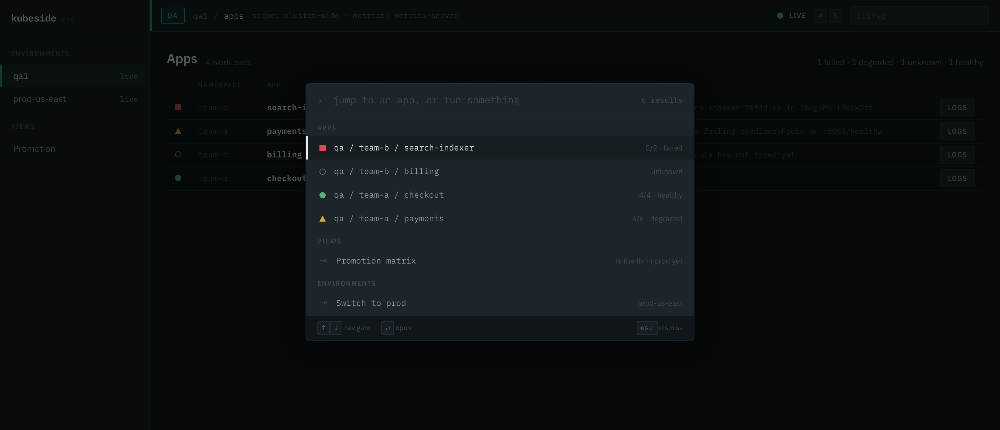

# Keyboard

Every navigation and every action is reachable from the keyboard. The palette is
the first thing a k9s user tries.

## The palette

| Key | Does |
| --- | --- |
| `Cmd K` / `Ctrl K` | Open the palette. |
| type | Filter. Matching is subsequence-based: `pay` finds payments, `tacheck` finds `team-a / checkout`. |
| `↑` `↓` | Move through results. |
| `Enter` | Run the selected command. |
| `Esc` | Close. |

An empty query lists everything, because the palette is also how you find out
what the tool can do.

## What it contains

- **Apps** — every app in the connected environment.
- **Actions** — logs, resolved configuration, timeline, and cross-environment
  comparison for whatever the current screen is about.
- **Views** — the promotion matrix.
- **Environments** — switch to another context.

Only environments that are already connected contribute their apps. Searching
every context in your kubeconfig would wake every cluster in it, which is
exactly what the connection model exists to avoid.

Actions that need a target are only offered when there is one. A "tail logs"
command with nothing selected is a command that cannot run.
